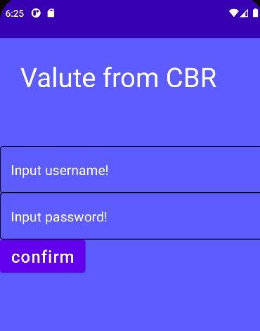
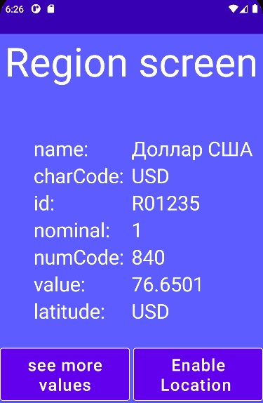
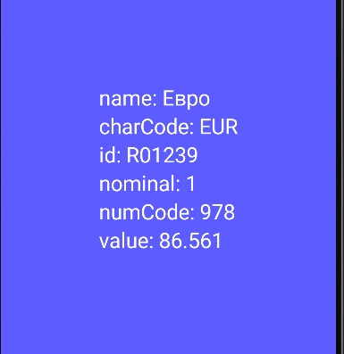

# Курс обмена с ЦБР

## В приложении в режиме онлайн можно отслеживать курс валют с центробанка России
## При открытии приложения всплывает окно входа, в которое нужно ввести логин и пароль(логин:admin пароль: admin).

## После введения верного логина и пароля Вы получаете доступ к курсу валюты Вашего региона(на основе геолокации), если такое возможно.

## После вы можете просмотреть полный список валют.

## В случае наличия обновления данных, приложение выведет уведомление об этом.
## Приложение реализовано на основе Jetpack Compose.

